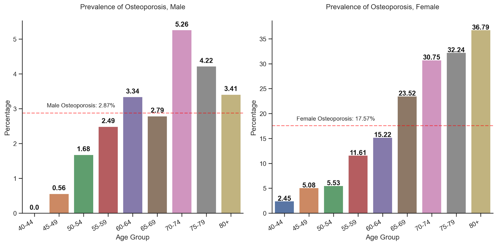
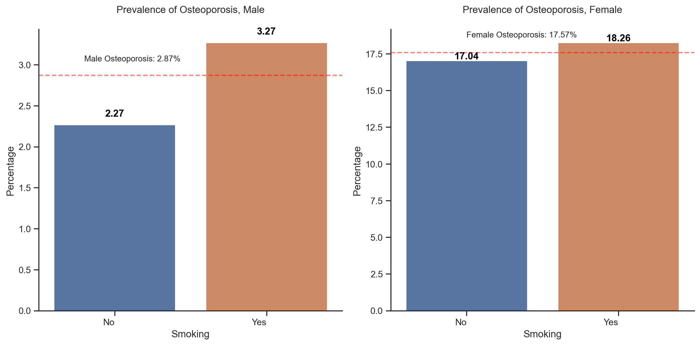
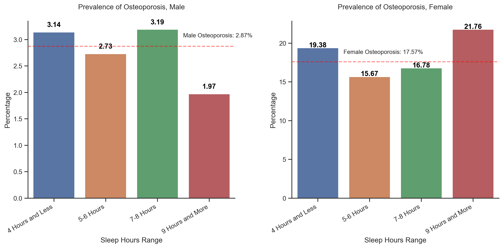
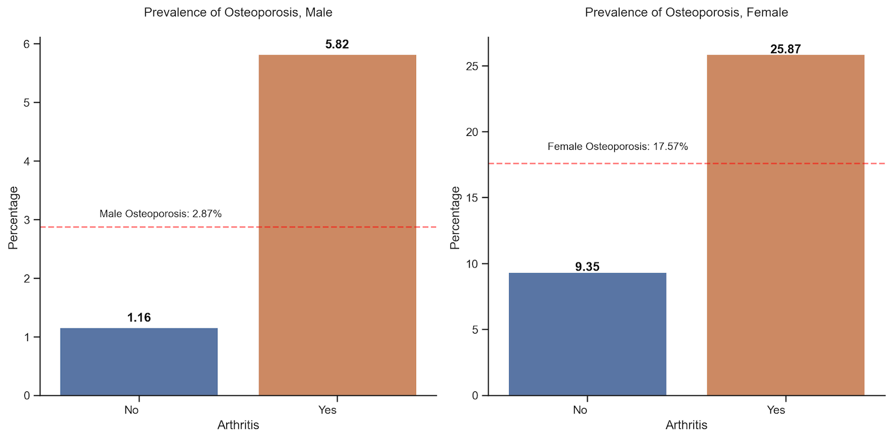
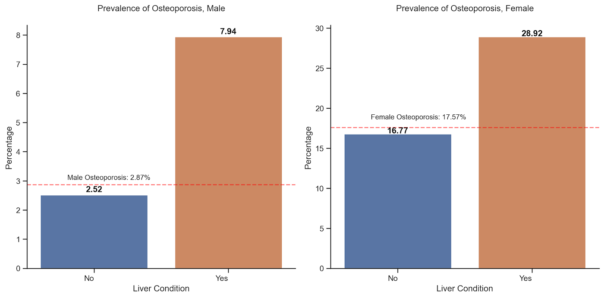
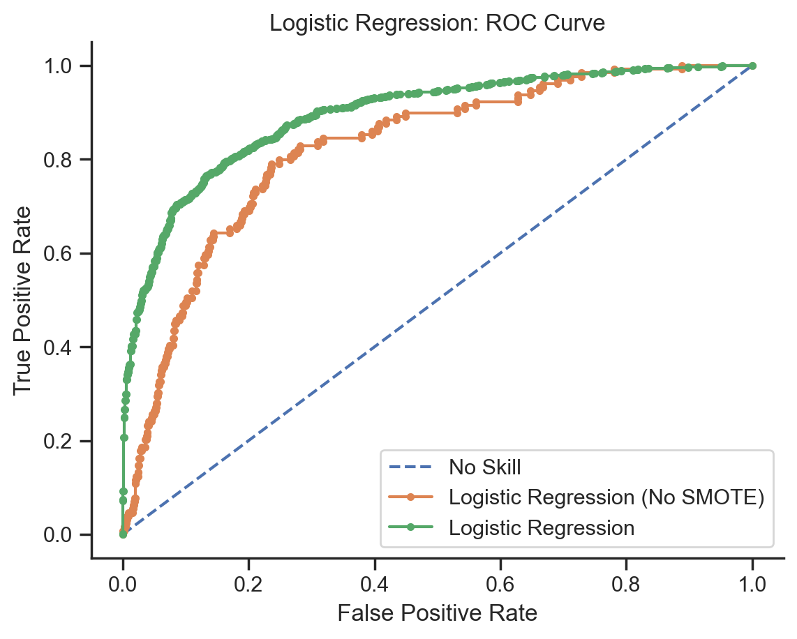

# Predicting Osteoporosis using NHANES Data

## TABLE OF CONTENTS

* [Objective](#objective)
* [Data Source](#data-source)
* [Data Preparation for Analysis](#data-preparation-for-analysis)
* [EDA](#eda)
* [Handling Imbalanced Data](#handling-imbalanced-data)
* [Results](#results)
* [Conclusion](#conclusion)

## Objective

- Find out the association among age, gender, race, BMI, smoking, alcohol, sleep hours, arthritis, and liver condition in patients with osteoporosis.
- Design an accurate approach to predict if someone has osteoporosis based on these metrics.

## Data Source

The National Health and Nutrition Examination Survey (NHANES) data for the years [2013-2014](https://wwwn.cdc.gov/nchs/nhanes/continuousnhanes/default.aspx?BeginYear=2013), and [2017-March 2020 Pre-Pandemic](https://wwwn.cdc.gov/nchs/nhanes/continuousnhanes/default.aspx?Cycle=2017-2020). The target sample for Osteoporosis Questionnaire in 2013-2014 and 2017-2020 were participants aged 40+ and 50+, respectively.

Note: Osteoporosis assessment in NHANES for 2015-2016 was not completed, so it's not included in this study.

## Data Preparation for Analysis
- Renamed variables based on the data documents. For example, renamed `RIDAGEYR` to `Age`, `SLD010H` to `Sleep Hours`.
- Converted code values to corresponding text values. For example,  "1" should be converted to "Mexican American" for variable `Race` and "Male" for variable `Gender`.
- For better interpretation, converted some continuous variables to categorical ones:
	- Age Group: 40-44, 45-49, 50-54, 55-59, 60-64, 65-69, 70-74, 75-79, 80+
	- BMI Group: Underweight (BMI < 18.5), Healthy Weight (18.5 <= BMI < 25),  Overweight (25.0 <= BMI < 30), Obesity (30.0 or higher)
	- Sleep Hours: 4 hours and less, 5-6 Hours, 7-8 Hours, 9 hours and more

- Merged all datasets by the respondent sequence number (`SEQN,` renamed to `ID`).

## EDA

Age, race, BMI, alcohol, smoking, sleep hours, arthritis, and liver condition affected the prevalence of osteoporosis differently for men and women.

#### The prevalence of osteoporosis was higher among women (17.57%) when compared to men (2.87%)

  

#### The prevalence of osteoporosis for women increased significantly after age 65

  

#### The risk of getting osteoporosis for Non-Hispanic White females was 1.16-2.11 times the risk for Mexican American females

  

#### Underweighted people, especially men, had higher risk of osteoporosis when compared to healthy weighted people

  

#### Heavy drinking had opposite effects on men and women, but neither was statistically significant in this study

  

#### People who smoked appear to have a higher risk of osteoporosis, but it's not statistically significant in this study

  

#### People had 5-6 hours sleep appear to have lower risk of osteoporosis, but it's not statistically significant in this study

  

#### People with arthritis had higher risk of osteoporosis when compared to those without arthritis

  

#### People with liver condition had higher risk of osteoporosis when compared to those without liver condition

  

## Handling Imbalanced Data

For such an imbalanced data (with osteoporosis: 9.9%, without osteoporosis: 90.1%). Applied Synthetic Minority Oversampling Technique (SMOTE) to oversample the minority class. With SMOTE, recall increased from 1.6% to 79.3%, f1 score increased from 0.03 to 0.81.
Here is a performance comparison of Logistic Regression with/without SMOTE.

  

| Model                          | Accuracy                       | Precision | Recall | F1 Score | AUC   |
|------------------- |-------------------- |-------  |--------|----------|-------|
| Logistic Regression (No SMOTE) | 0.901                          | 0.500     | 0.016  | 0.030     | 0.823 |
| Logistic Regression (SMOTE)    | 0.824                          | 0.829     | 0.816  | 0.823    | 0.905 |

## Results
Created Logistic Regression, SVM, Neural Networks, and XGBoost models to predict osteoporosis based on age, gender, race, BMI, smoking, alcohol, arthritis, and liver condition. **XGBoost** performed best in all aspects, with sensitivity (recall) 91.6%, precision of 93.6%, f1 score 0.925 and a measured AUC of 0.979.

**ROC Curves**

  

**Scores**

| Model               | Accuracy | Precision | Recall | F1 Score | AUC   |
|---------------------|----------|-----------|--------|----------|-------|
| XGBoost             | 0.918    | 0.933     | 0.902  | 0.917    | 0.979 |
| SVM                 | 0.873    | 0.869     | 0.878  | 0.873    | 0.920 |
| Neural Networks     | 0.831    | 0.849     | 0.805  | 0.826    | 0.911 |
| Logistic Regression | 0.824    | 0.829     | 0.816  | 0.823    | 0.905 |

## Conclusion

This study focused on finding the association between age, gender, race, BMI, smoking, alcohol, arthritis, and liver condition with osteoporosis.
The results showed that women had a higher risk of osteoporosis than men, and it increased with age. Additionally, osteoporosis was associated with underweight, arithritis, and liver conditions. The predictive model with the XGBoost algorithm can be used as an inference agent to assist professionals in osteoporosis diagnosis.
