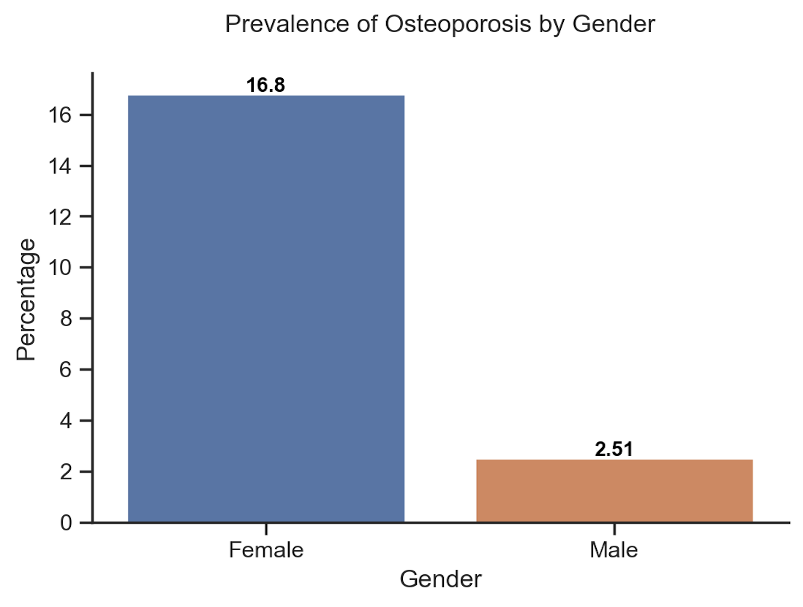

# [Predicting Osteoporosis using NHANES Data](https://github.com/eeliuqin/Osteoporosis-Analysis-and-Prediction-on-NHANES-Data/blob/main/predict-osteoporosis.ipynb)

## TABLE OF CONTENTS

* [Introduction](#introduction)
* [Objective](#objective)
* [Language and Tools](#language-and-tools)
* [Data Source](#data-source)
* [Data Processing](#data-processing)
* [EDA](#eda)
* [Handling Imbalanced Data](#handling-imbalanced-data)
* [Model Selection](#model-selection)
* [Results](#results)
* [Conclusions](#conclusions)

## Introduction
Osteoporosis, the most common bone disease, occurs when bone mineral density and bone mass decrease, or there are changes in bone structure and strength. In 2010, an estimated 10.2 million people in the United States aged 50 and over had osteoporosis, and an estimated 43.3 million others had low bone mass [[1](#1)]. However, it is a silent disease that most people with osteoporosis do not know they have it until they break a bone.  Therefore, accurate prediction of osteoporosis is of great public health benefit.

To my best of knowledge, most osteoporosis prediction studies either focus on specific laboratory examination [[2](#2)], or on specific patient groups such as postmenopausal women [[3](#3)]. A study using more general data and targeting a wider population is needed.

## Objective

Design a method to predict whether someone has **osteoporosis** based on age, gender, race, BMI, smoking, alcohol consumption, sleep hours, arthritis, liver condition, and whether a parent has osteoporosis.

Note: Age, gender, race, BMI, smoking, alcohol consumption were inspired by a paper on predicting hypertension using a similar dataset [[4](#4)]. Sleep hours, arthritis, liver condition, parent osteoporosis were inspired by [[5](#5)], [[6](#6)], [[7](#7)], and [[8](#8)], respectively.

## Language and Tools
- Language: Python
- Libraries: Pandas, Numpy, Matplotlib, Seaborn, Imblearn, Sklearn, Tensorflow 
- Tools: Jupyter Notebook

## Data Source

The National Health and Nutrition Examination Survey (NHANES) is a program of studies designed to assess the health and nutritional status of adults and children in the United States. Datasets of this program are prepared and published through the Centers for Disease Control and Prevention (CDC) and available to the public.

This study focuses on NHANES data for the years [2013-2014](https://wwwn.cdc.gov/nchs/nhanes/continuousnhanes/default.aspx?BeginYear=2013), and [2017-March 2020 Pre-Pandemic](https://wwwn.cdc.gov/nchs/nhanes/continuousnhanes/default.aspx?Cycle=2017-2020), including the following:
- Demographics Data: Age, Gender, Race
- Examination Data: Body Measures (BMI)
- Questionnaire Data: Osteoporosis, Cigarette Use, Alcohol Use, Sleep Disorders, Medical Conditions (Arthritis, Liver Condition)

Note: The target sample for Osteoporosis Questionnaire in 2013-2014 and 2017-2020 were participants aged 40+ and 50+, respectively. Osteoporosis assessment in NHANES for 2015-2016 was not completed, so it's not included in this study.

## Data Processing

### Cleaning and Merging the Data
- Renamed variables based on the data documents. For example, renamed `RIDAGEYR` to `Age`, `SLD010H` to `Sleep Hours`.
- Converted code values to corresponding text values. For example,  "1" should be converted to "Mexican American" for variable `Race` and "Male" for variable `Gender`.
- Full joined datasets by the respondent sequence number (`SEQN,` renamed to `ID`).

After merging, the data has 25735 rows x 10 columns, and the percentage of missing values is shown in the table:

 

| Variable        | Missing (%) |
|-----------------|-------------|
| BMI             | 13.8        |
| Sleep Hours     | 35.7        |
| Smoking         | 38.6        |
| Arthritis       | 42.0        |
| Liver Condition | 42.0        |
| Heavy Drinking  | 53.5        |
| Osteoporosis    | 65.9        |
| Parent Osteoporosis    | 67.9        |

### Handling Missing Values

Reasons of missing values:
1. The Osteoporosis Questionnaire focused on 8802 people (aged 40+ in 2013-2014, aged 50+ in 2017-2020), while other data such as Demographic, focused on 25735 people aged 0-80.
2. Someone people didn't answer all questions.

For 1), just ignore the missing values from Osteoporosis to focus on aged 40+, because osteoporosis is rare in young people and more common among people over age 50 [[8](#8), [9](#9)].

For 2), this is the distribution of all data vs missing data:

  

They have similar distributions, removing missing data should not cause too much bias, besides, data imputation is not considered in this study as it leads to inaccracy and uncertainty.

Therefore, the study analyzed complete data only, with a dimension of 6144 rows x 11 columns.

## EDA

The dataset is imbalanced with a 9:1 ratio of people with and without osteoporosis:

  

The prevalence of osteoporosis is associated differently with variables, such as:

  
&nbsp; &nbsp; 
    

&nbsp;

  
&nbsp; &nbsp; 
    

## Feature Engineering

Binning the following variables for higher mutual information scores:

- BMI Group: Underweight (BMI < 18.5), Healthy Weight (18.5 <= BMI < 25),  Overweight (25.0 <= BMI < 30), Obesity (30.0 or higher)
- Sleep Hours: 4 hours and less, 5-6 Hours, 7-8 Hours, 9 hours and more

## Handling Imbalanced Data

For such an imbalanced data (with osteoporosis: 9.9%, without osteoporosis: 90.1%), models probably have much poor predictive performance for the minority class (with osteoporosis) than the majority (without), however, correct prediction of the minority class is more important. 

There are 3 options for addressing imbalanced data: Undersampling, Oversampling, and Combination of undersampling and oversampling. The main disadvantage of undersampling is that it will discard potentially useful data, so it will not be considered in this project. Oversampling does not cause any loss of information, and in some cases, may perform better than undersampling. However, oversampling often involves duplicating a small number of events, which leads to overfitting. To balance these concerns, some scenarios may require a combination of undersampling and oversampling to obtain the most realistic dataset and accurate results.

This project compared 2 oversampling methods (Adaptive Synthetic Sampling Approach (ADASYN)[[10](#10)], Synthetic Minority Oversampling Technique (SMOTE) [[11](#11)]）and 1 combination method (SMOTETomek [[12](#12)]), here is the performance metrics of Logistic Regression with original data only, after ADASYN, after SMOTE, and after SMOTETomek:

| Model                          | Accuracy                       | Precision | Recall | F1 Score | AUC   |
|------------------- |-------------------- |-------  |--------|----------|-------|
| Logistic Regression (ADASYN)   | 0.765     | 0.260     | 0.833  | 0.397    | 0.864 |
| Logistic Regression (SMOTE)    | 0.778     | 0.265     | 0.789  | 0.397    | 0.866 |
| Logistic Regression (SMOTETomek)  | 0.777     | 0.263     | 0.781  | 0.394    | 0.866 |
| Logistic Regression (Original Data) | 0.910     | 0.552     | 0.140  | 0.224    | 0.869 |

All 3 resampling methods sigfinicantly improved recall and F1 score, with **ADASYN** performing best. Therefore it's applied to the training dataset.

## Model Selection
Benchmarking 4 popular classification algorithms:

| Model                         | Pros                | Cons                                |
|------------------------------ |-------------------- |-------------------------------------|
| Logistic Regression       | easier to set up and train than other machine learning applications; very efficient when the dataset has features that are linearly separable | fails to capture complex relationships; overfits on high dimensional data  |
| Support Vector Machines (SVM) | works well with a clear margin of separation; effective in high-dimensional spaces   | doesn't perform well when the dataset is large or has more noise    |
| Random Forest                 | works well with non-linear data; lower risk of overfitting   | not suitable for dataset with a lot of sparse features  |
| Neural Networks               |  works well with non-linear data with large number of inputs; fast predictions once trained | works like a black box and not interpretable; computation is expensive and time consuming |

## Results
Predicted osteoporosis based on age, gender, race, BMI, smoking, alcohol, arthritis, liver condition, and parent osteoporosis with above models,
**Neural Networks** performed best, and after optimization, it achieved sensitivity (recall) 71.1%, precision 32.5%, f1 score 0.446 and AUC 0.852.

**ROC Curves**

  

**Performance Metrics**

| Model               | Accuracy | Precision | Recall | F1 Score | AUC   |
|---------------------|----------|-----------|--------|----------|-------|
| Neural Networks   | 0.836     | 0.325     | 0.711  | 0.446    | 0.852 |
| Logistic Regression    | 0.765     | 0.260     | 0.833  | 0.397    | 0.864 |
| SVM  | 0.782     | 0.262     | 0.746  | 0.388    | 0.821 |
| Random Forest | 0.876     | 0.339     | 0.360  | 0.349    | 0.807 |

## Conclusions

This study focused on predicting osteoporosis based on age, gender, race, BMI, smoking, alcohol, arthritis, liver condition, and parent osteoporosis.
The analyzed results showed that women had a higher risk of osteoporosis than men, and it increased with age. Additionally, osteoporosis was associated with underweight, arthritis, and parent osteoporosis. The predictive model with Neural Networks algorithm can be used as an inference agent to assist professionals in osteoporosis diagnosis.

## References

<a id="1">[1]</a> Wright NC, Looker AC, Saag KG, Curtis JR, Delzell ES, Randall S, Dawson-Hughes B. The recent prevalence of osteoporosis and low bone mass in the United States based on bone mineral density at the femoral neck or lumbar spine. J Bone Miner Res 29(11):2520–6. 2014.
 
<a id="2">[2]</a> Theodoros Iliou, Christos-Nikolaos Anagnostopoulos, Ioannis M. Stephanakis, George Anastassopoulos, A novel data preprocessing method for boosting neural network performance: A case study in osteoporosis prediction, Information Sciences, Volume 380, 2017.
 
<a id="3">[3]</a> S. K. Kim, T. K. Yoo, E. Oh and D. W. Kim, "Osteoporosis risk prediction using machine learning and conventional methods," 2013 35th Annual International Conference of the IEEE Engineering in Medicine and Biology Society (EMBC), Osaka, Japan, 2013, pp. 188-191, doi: 10.1109/EMBC.2013.6609469.
 
<a id="4">[4]</a> López-Martínez, Fernando, et al. "An artificial neural network approach for predicting hypertension using NHANES data." Scientific Reports 10.1 (2020): 1-14.
 
<a id="5">[5]</a> Ochs-Balcom HM, Hovey KM, Andrews C, Cauley JA, Hale L, Li W, Bea JW, Sarto GE, Stefanick ML, Stone KL, Watts NB, Zaslavsky O, Wactawski-Wende J. Short Sleep Is Associated With Low Bone Mineral Density and Osteoporosis in the Women's Health Initiative. J Bone Miner Res. 2020 Feb;35(2):261-268. doi: 10.1002/jbmr.3879. Epub 2019 Nov 6. PMID: 31692127; PMCID: PMC8223077.
 
<a id="6">[6]</a> [What People With Rheumatoid Arthritis Need To Know About Osteoporosis](https://www.bones.nih.gov/health-info/bone/osteoporosis/conditions-behaviors/osteoporosis-ra)
 
<a id="7">[7]</a> Handzlik-Orlik G, Holecki M, Wilczyński K, Duława J. Osteoporosis in liver disease: pathogenesis and management. Ther Adv Endocrinol Metab. 2016 Jun;7(3):128-35. doi: 10.1177/2042018816641351. Epub 2016 Apr 6. PMID: 27293541; PMCID: PMC4892399.
 
<a id="8">[8]</a> [Does Osteoporosis Run in Your Family](https://www.cdc.gov/genomics/disease/osteoporosis.htm#:~:text=Osteoporosis%20is%20more%20common%20in,until%20they%20break%20a%20bone.)
 
<a id="9">[9]</a> [Juvenile Osteoporosis](https://www.bones.nih.gov/health-info/bone/bone-health/juvenile/juvenile-osteoporosis)
 
<a id="10">[10]</a> Haibo He, Yang Bai, E. A. Garcia and Shutao Li, "ADASYN: Adaptive synthetic sampling approach for imbalanced learning," 2008 IEEE International Joint Conference on Neural Networks (IEEE World Congress on Computational Intelligence), Hong Kong, 2008, pp. 1322-1328, doi: 10.1109/IJCNN.2008.4633969.
 
<a id="11">[11]</a> Chawla, N. V., Bowyer, K. W., Hall, L. O., & Kegelmeyer, W. P. (2002). SMOTE: synthetic minority over-sampling technique. Journal of Artificial Intelligence Research, 16, 321–357.
 
<a id="12">[12]</a> G. Batista, B. Bazzan, M. Monard, “Balancing Training Data for Automated Annotation of Keywords: a Case Study,” In WOB, 10-18, 2003.

