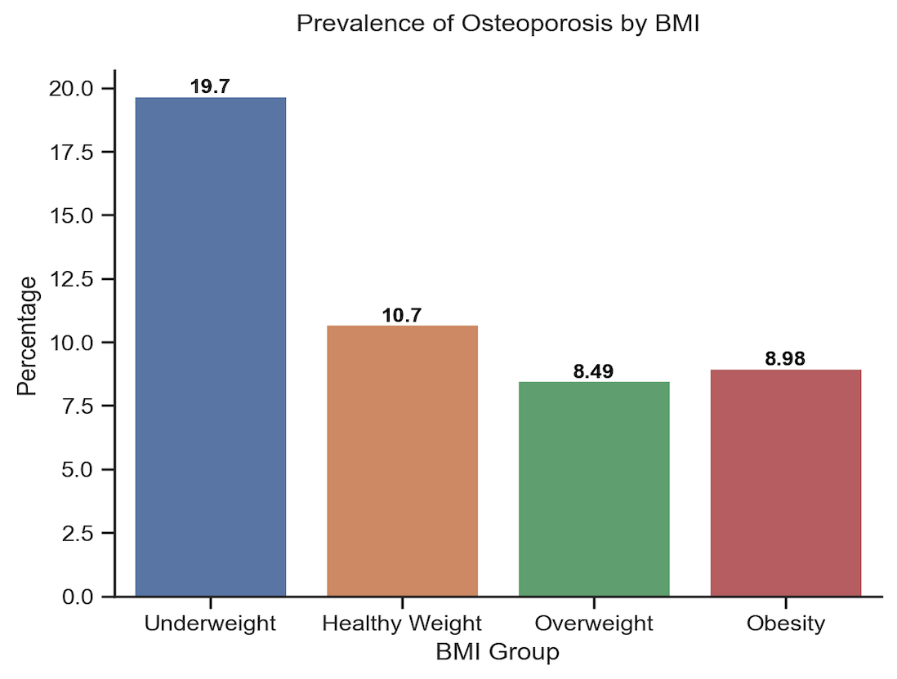
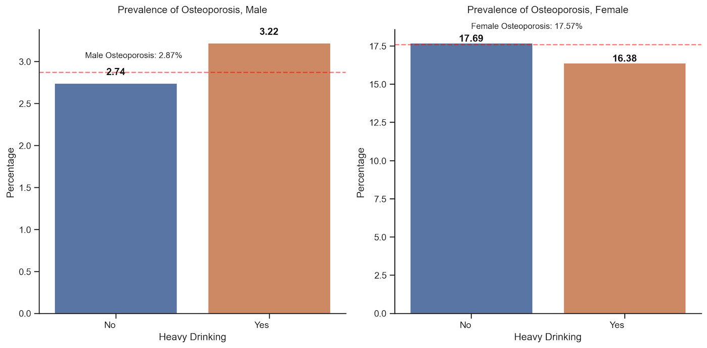
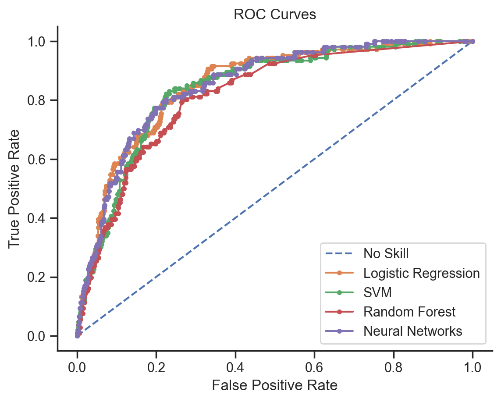

# [Predicting Osteoporosis using NHANES Data](https://github.com/eeliuqin/Osteoporosis-Analysis-and-Prediction-on-NHANES-Data/blob/main/predict-osteoporosis.ipynb)

## TABLE OF CONTENTS

* [Introduction](#introduction)
* [Objective](#objective)
* [Data Source](#data-source)
* [Data Preparation for Analysis](#data-preparation-for-analysis)
* [EDA](#eda)
* [Handling Imbalanced Data](#handling-imbalanced-data)
* [Model Selection](#model-selection)
* [Results](#results)
* [Conclusions](#conclusions)

## Introduction
Osteoporosis, the most common bone disease, occurs when bone mineral density and bone mass decrease, or there are changes in bone structure and strength. In 2010, an estimated 10.2 million people in the United States aged 50 and over had osteoporosis, and an estimated 43.3 million others had low bone mass [[1](#1)]. However, it is a silent disease that most people with osteoporosis do not know they have it until they break a bone.  Therefore, accurate prediction of osteoporosis is of great public health benefit.

To my best of knowledge, most osteoporosis prediction studies either focus on specific laboratory examination [[2](#2)], or on specific patient groups such as postmenopausal women [[3](#3)]. A study using more general data and targeting a wider population is needed.

## Objective

Design a method to predict whether someone has **osteoporosis** based on age, gender, race, BMI, smoking, alcohol consumption, sleep hours, arthritis and liver condition.

Note: Age, gender, race, BMI, smoking, alcohol consumption were inspired by a paper on predicting hypertension using a similar dataset [[4](#4)]. Sleep hours, arthritis, and liver condition were inspired by [[5](#5)], [[6](#6)], and [[7](#7)], respectively.

## Data Source

The National Health and Nutrition Examination Survey (NHANES) is a program of studies designed to assess the health and nutritional status of adults and children in the United States. Datasets of this program are prepared and published through the Centers for Disease Control and Prevention (CDC) and avaiable to the public.

This study focuses on NHANES data for the years [2013-2014](https://wwwn.cdc.gov/nchs/nhanes/continuousnhanes/default.aspx?BeginYear=2013), and [2017-March 2020 Pre-Pandemic](https://wwwn.cdc.gov/nchs/nhanes/continuousnhanes/default.aspx?Cycle=2017-2020), including the following:
- Demographics Data: Age, Gender, Race
- Examination Data: Body Measures (BMI)
- Questionnaire Data: Osteoporosis, Cigarette Use, Alcohol Use, Sleep Disorders, Medical Conditions (Arthritis, Liver Condition)

Note: The target sample for Osteoporosis Questionnaire in 2013-2014 and 2017-2020 were participants aged 40+ and 50+, respectively. Osteoporosis assessment in NHANES for 2015-2016 was not completed, so it's not included in this study.

## Data Preparation for Analysis
- Renamed variables based on the data documents. For example, renamed `RIDAGEYR` to `Age`, `SLD010H` to `Sleep Hours`.
- Converted code values to corresponding text values. For example,  "1" should be converted to "Mexican American" for variable `Race` and "Male" for variable `Gender`.
- For better interpretation, binning the continuous variables into categorical ones:
	- Age Group: 40-44, 45-49, 50-54, 55-59, 60-64, 65-69, 70-74, 75-79, 80+
	- BMI Group: Underweight (BMI < 18.5), Healthy Weight (18.5 <= BMI < 25),  Overweight (25.0 <= BMI < 30), Obesity (30.0 or higher)
	- Sleep Hours: 4 hours and less, 5-6 Hours, 7-8 Hours, 9 hours and more

- Merged all datasets by the respondent sequence number (`SEQN,` renamed to `ID`), resulting in a dataframe with 6509 rows, 10 columns.

Note: Binning of continuous variables (age, BMI, sleep hours) was just used in Exploratory Data Analysis (EDA) for easier interpretation and better visualization.
In machine learning models, these variables were kept as continuous to avoid discarding potentially meaningful data.

## EDA

#### Overall distributions of the NHANES data
The dataset is imbalanced with a ratio of 9:1 with and without osteoporosis

  

Age, race, BMI, alcohol, smoking, sleep hours, arthritis, and liver condition affected the prevalence of osteoporosis differently for men and women.

#### The prevalence of osteoporosis was higher among women (17.57%) when compared to men (2.87%)

  

#### The prevalence of osteoporosis for women increased significantly after age 65

  

#### The risk of getting osteoporosis for Non-Hispanic White females was 1.6 times the risk for Mexican American females

  

#### Underweighted people, especially men, had higher risk of osteoporosis when compared to healthy weighted people

  

#### Heavy drinking had opposite effects on men and women, although neither was statistically significant in this study

  

#### People who smoked appear to have a higher risk of osteoporosis, although it's not statistically significant in this study

  

#### People had 5-6 hours sleep appear to have lower risk of osteoporosis, although it's not statistically significant in this study

  

#### People with arthritis had higher risk of osteoporosis when compared to those without arthritis

  

#### People with liver condition had higher risk of osteoporosis when compared to those without liver condition

  

## Handling Imbalanced Data

For such an imbalanced data (with osteoporosis: 9.9%, without osteoporosis: 90.1%), models probably have much poor predictive performance for the minority class (with osteoporosis) than the majority (without), however, correct prediction of the minority class is more important. 

There are 3 options for addressing imbalanced data: Undersampling, Oversampling, and Combination of undersampling and oversampling. The main disadvantage of undersampling is that it will discard potentially useful data, so it will not be considered in this project. Oversampling does not cause any loss of information, and in some cases, may perform better than undersampling. However, oversampling often involves duplicating a small number of events, which leads to overfitting. To balance these concerns, some scenarios may require a combination of undersampling and oversampling to obtain the most realistic dataset and accurate results.

This project compared 2 oversampling methods (Adaptive Synthetic Sampling Approach (ADASYN)[[8](#8)], Synthetic Minority Oversampling Technique (SMOTE) [[9](#9)]）and 1 combination method (SMOTETomek [[10](#10)]), here is the performance metrics of Logistic Regression with original data only, after ADASYN, after SMOTE, and after SMOTETomek:

| Model                          | Accuracy                       | Precision | Recall | F1 Score | AUC   |
|------------------- |-------------------- |-------  |--------|----------|-------|
| Logistic Regression (ADASYN) | 0.742                          | 0.252     | 0.814  | 0.385     | 0.827 |
| Logistic Regression (SMOTETomek)    | 0.747                          | 0.251     | 0.783  | 0.380    | 0.826 |
| Logistic Regression (SMOTE)    | 0.747                          | 0.248     | 0.767  | 0.375    | 0.826 |
| Logistic Regression (Original Data)    | 0.896                          | 0.250     | 0.023  | 0.043    | 0.825 |

**ADASYN** has the best performance, so it's been applied to the training dataset.

## Model Selection
Compared 4 models in this project:

#### Logistic Regression
Pros: easier to set up and train than other machine learning applications 
Cons: fails to capture complex relationships

#### Support Vector Machines (SVM)
Pros: works well with a clear maring of separation; effective in high-dimensional spaces 
Cons: doesn't perform well when the dataset is large or has more noise

#### Random Forest
Pros: works well with non-linear data; lower risk of overfitting 
Cons: not suitable for dataset with a lot of sparse features 

#### Neural Networks
Pros: works well with non-linear data with large number of inputs; fast predictions once trained 
Cons: works like a black box and not interpretable; computation is expensive and time consuming

## Results
Predicted osteoporosis based on age, gender, race, BMI, smoking, alcohol, arthritis, and liver condition with above models,
**Neural Networks** performed best, with sensitivity (recall) 73%, precision 27.2%, f1 score 0.397 and AUC 0.832.

**ROC Curves**

  

**Performance Metrics**

| Model               | Accuracy | Precision | Recall | F1 Score | AUC   |
|---------------------|----------|-----------|--------|----------|-------|
| Neural Networks             | 0.780    | 0.272     | 0.729  | 0.397    | 0.832 |
| Logistic Regression | 0.742    | 0.252     | 0.814  | 0.385    | 0.827 |
| SVM     | 0.831    | 0.849     | 0.805  | 0.826    | 0.911 |
| Logistic Regression | 0.824    | 0.829     | 0.816  | 0.823    | 0.905 |

## Conclusions

This study focused on finding the association between age, gender, race, BMI, smoking, alcohol, arthritis, and liver condition with osteoporosis.
The results showed that women had a higher risk of osteoporosis than men, and it increased with age. Additionally, osteoporosis was associated with underweight, arithritis, and liver conditions. The predictive model with Neural Networks algorithm can be used as an inference agent to assist professionals in osteoporosis diagnosis.

## References

<a id="1">[1]</a> Wright NC, Looker AC, Saag KG, Curtis JR, Delzell ES, Randall S, Dawson-Hughes B. The recent prevalence of osteoporosis and low bone mass in the United States based on bone mineral density at the femoral neck or lumbar spine. J Bone Miner Res 29(11):2520–6. 2014.
 
<a id="2">[2]</a> Theodoros Iliou, Christos-Nikolaos Anagnostopoulos, Ioannis M. Stephanakis, George Anastassopoulos, A novel data preprocessing method for boosting neural network performance: A case study in osteoporosis prediction, Information Sciences, Volume 380, 2017.
 
<a id="3">[3]</a> S. K. Kim, T. K. Yoo, E. Oh and D. W. Kim, "Osteoporosis risk prediction using machine learning and conventional methods," 2013 35th Annual International Conference of the IEEE Engineering in Medicine and Biology Society (EMBC), Osaka, Japan, 2013, pp. 188-191, doi: 10.1109/EMBC.2013.6609469.
 
<a id="4">[4]</a> López-Martínez, Fernando, et al. "An artificial neural network approach for predicting hypertension using NHANES data." Scientific Reports 10.1 (2020): 1-14.
 
<a id="5">[5]</a> Ochs-Balcom HM, Hovey KM, Andrews C, Cauley JA, Hale L, Li W, Bea JW, Sarto GE, Stefanick ML, Stone KL, Watts NB, Zaslavsky O, Wactawski-Wende J. Short Sleep Is Associated With Low Bone Mineral Density and Osteoporosis in the Women's Health Initiative. J Bone Miner Res. 2020 Feb;35(2):261-268. doi: 10.1002/jbmr.3879. Epub 2019 Nov 6. PMID: 31692127; PMCID: PMC8223077.
 
<a id="6">[6]</a> [What People With Rheumatoid Arthritis Need To Know About Osteoporosis](#https://www.bones.nih.gov/health-info/bone/osteoporosis/conditions-behaviors/osteoporosis-ra)
 
<a id="7">[7]</a> Handzlik-Orlik G, Holecki M, Wilczyński K, Duława J. Osteoporosis in liver disease: pathogenesis and management. Ther Adv Endocrinol Metab. 2016 Jun;7(3):128-35. doi: 10.1177/2042018816641351. Epub 2016 Apr 6. PMID: 27293541; PMCID: PMC4892399.
 
<a id="8">[8]</a> Haibo He, Yang Bai, E. A. Garcia and Shutao Li, "ADASYN: Adaptive synthetic sampling approach for imbalanced learning," 2008 IEEE International Joint Conference on Neural Networks (IEEE World Congress on Computational Intelligence), Hong Kong, 2008, pp. 1322-1328, doi: 10.1109/IJCNN.2008.4633969.
 
<a id="9">[9]</a> Chawla, N. V., Bowyer, K. W., Hall, L. O., & Kegelmeyer, W. P. (2002). SMOTE: synthetic minority over-sampling technique. Journal of Artificial Intelligence Research, 16, 321–357.
 
<a id="10">[10]</a> G. Batista, B. Bazzan, M. Monard, “Balancing Training Data for Automated Annotation of Keywords: a Case Study,” In WOB, 10-18, 2003.

