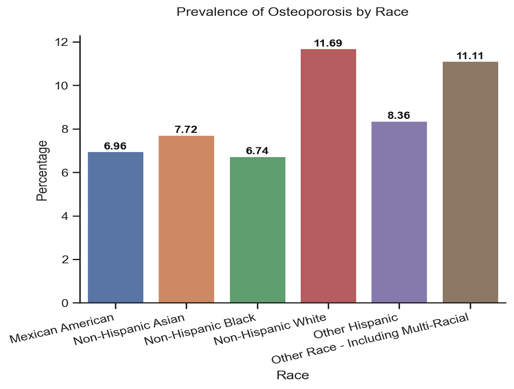

# Predicting Osteoporosis using N Data
## Objective

- Find out the association among age, gender, race, BMI, smoking, alcohol, arthritis, and liver condition in patients with osteoporosis.
- Design an accurate approach to predict if someone has osteoporosis based on these metrics.

## Data Source

The National Health and Nutrition Examination Survey (NHANES) data for the years [2013-2014](https://wwwn.cdc.gov/nchs/nhanes/continuousnhanes/default.aspx?BeginYear=2013), and [2017-March 2020 Pre-Pandemic](https://wwwn.cdc.gov/nchs/nhanes/continuousnhanes/default.aspx?Cycle=2017-2020). 2015-2016 was skipped because Osteoporosis assessment in NHANES for that period was not completed.

## Data Preparation for Analysis
- Renamed variables based on the data documents. For example, renamed `RIDAGEYR` to `Age`, `SLD010H` to `Sleep Hours`.
- Converted code values to corresponding text values. For example,  "1" should be converted to "Yes" for variable `Age` and "Male" for variable `Gender`.
- For better interpretation, converted some continuous variables to categorical ones:
	- Age Group: 40-44, 45-49, 50-54, 55-59, 60-64, 65-69, 70-74, 75-79, 80+
	- BMI Group: Underweight (BMI < 18.5), Healthy Weight (18.5 <= BMI < 25),  Overweight (25.0 <= BMI < 30), Obesity (30.0 or higher)
	- Sleep Hours: 4 hours and less, 5-6 Hours, 7-8 Hours, 9 hours and more

- Merged all datasets by the respondent sequence number (`SEQN,` renamed to `ID`).

## EDA
The prevalence of osteoporosis for men and women is affected by these metrics very differently.

- The prevalence of osteoporosis was higher among women (17.57%) when compared to men (2.87%)

  

- The prevalence of osteoporosis for women increased significantly after age 65

  

- The risk of getting osteoporosis for Non-Hispanic White females was 1.16-2.11 times the risk for Mexican American females

  

- Underweighted people, especially men, had higher risk of osteoporosis when compared to healthy weighted people

  

- Heavy drinking had opposite effects on men and women, but neither was statistically significant in this project

  

- People who smoked appear to have a higher risk of osteoporosis, but it's not statistically significant in this project

  

- People had 5-6 hours sleep appear to have lower risk of osteoporosis, but it's not statistically significant in this project

  

- People with arthritis had higher risk of osteoporosis when compared to those without arthritis

  

- People with liver condition had higher risk of osteoporosis when compared to those without liver condition

  

